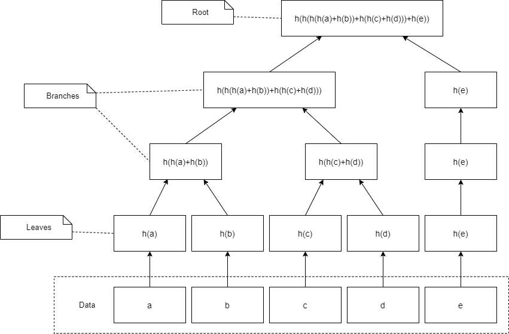

# merkle-tree-js

This repository was created for the CSBC2000 class with the purpose to demonstrate how a Merkle tree is created.

## What is a Merkle Tree? 🌳

Named after Ralph Merkle, a Merkle tree is a data structure used to encode data efficiently and securely by repeatedly applying a hashing function. A Merkle tree consists of leaves, branches, and a root. As shown in the image below, the leaves are the hashes on the bottom row, the branches are the hashes in the center, and the root is the final top hash.



## How to start the repo? 🤔

1. [Clone](https://docs.github.com/en/repositories/creating-and-managing-repositories/cloning-a-repository) the repo, and on your local machine, go to the folder and install dependencies.

```bash
    npm i
```

2. Run the app

```bash
    npm start
```
